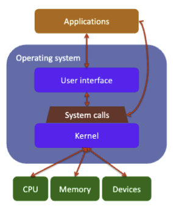
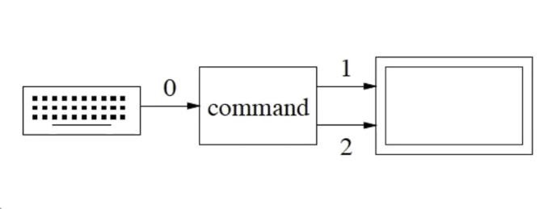

# Operating Systems

An operating system provides an abstraction layer for clients to interact with the underlying resources of a computer. The OS manages apps, time sharing, communication, fair use of CPU, memory, and devices. It also prevents misbehavior and the UI can be graphical or command line.



## The Shell

Humans don't interact with the raw OS directly. The user can use the native OS GUI (if there is one), or a shell (command line interface). Applications can talk to the raw OS, or the OS GUI, or the CLI (shell scripts).

__MacOS__
- Two layers. A GUI sits on top of the Darwin UNIX dialec.
- iOs also sits on top of Darwin, but Darwin is inaccessible to normal users in iOS.
- Similarly, Android and KindleOS sits on top of Linux. Windows 95/98/ME did the asme thing with DOS.

# A Brief History of UNIX


UNIX was a massive achievement in computing systems. UNIX focused on "doing one thing well" and combining processes into a pipeline. The UNIX operating system and the C programming language were developed together.

Early versions of UNIX were written in PDP-7 Assembly. Later rewritten in C, which was a __huge__ win because C was a high-level programming language which humans could understand. Later, C++ was also developed there by Stroustrup et al.

__What does UNIX stand for?__
UNIX is not an acronym; it's Kernighan's lame joke, a play on MULTICS (Multiplexed Information and Computing Service), another well known OS at the time.


## Versions of UNIX

AT&T's licensing allowed people to make their own variants.
- BSD UNIX (late 1970s) at UC-Berkeley, reimplementation with brand new code and new design ideas.
- OS X, __iOS__ are both based on NextStep (Steve Jobs' old company), which is in turn based on BSD; "Darwin"
- Android, KindleOS are based on __Linux__ (mid-1990s, open source project)
- Solaris / SunOS (early 1980s, Sun Microsystems, now owned by Oracle)
- AIX, HP-UX, SCO, ... other commercial Unices

# GNU

The name for some African wildebeest in Afrikaans. In 1984, Richard M. Stallman founds the GNU (Gnu's Not Unix) project and later the FSF (Free Software Foundation). His goal was to provide a truly free UNIX-like operating system. Free like speech, not free like beer. The GPL license "virus" ensures software remains free.

GNU continues to have MASSIVE impact today.
- Most of the web runs on technology based on open standards
- Open source software systems include: GNU-Linux/BSD, Firefox/Chrome, GCC/LLVM, Apache, LibreOffice

As you can see there are some big names up there.

## The Original Components of the GNU System

1. GCC (Gnu Compiler Collection)
    - gcc, g++, ...
2. `glibc` (Gnu C library)
3. GNU core utilities (`ls`, `cp`/`rm`/`mv`, `chmod`, ...)
4. Some other stuff too (a shell, `gdb`, ...)
5. Not an actual OS kernel!

These are all from-scratch entirely-new-code re-implementations of existing tools from the (proprietary) UNIX. With GPL, this means they are free in any future derivative work.

# Linux

In a time where there were many commercial UNIX systems, Finnish student Linus Torvalds started Linux as a part time project in 1991; many programmers join in "for fun"; v1.0 released in 1994.

__What is Linux?__
- Technically it's just the OS kernel (bridge between components and system calls).
- A Linux distro (e.g., Ubuntu, Debian, ArchLinux) contains a lot of "free software" (much of it, GNU) so people can actually use it.
- Richard calls it GNU/Linux

# The UNIX File System

The UNIX file system is organized under "/", the root directory.


For example you could host your personal site under `public_html`.

Pretty much all OSs have a file system of some kind, your home directory (folder) is where your stuff is stored, not the system stuff, and not the stuff of the others who use your computer.

My home dir is in `/Users/infin` on MacOS. At the command line, you can reference your home dir by ~ or $HOME. `~infin` represents the home directory of `infin`, no slash.

`sh` was the first practical, widely-used UNIX shell. Later relatives, like `bash` and `ksh` were created, intended to allow programmers to write shell scripts. Other common shells include `csh`, `tcsh` are meant for live "end users"

## Commands in the UNIX Shell

By default we start in the home dir.
- `cd` takes you back home.
- `cd -` takes you to the last dir.
- `cd ..` takes you to the parent of the current dir.
- `cd .` leaves you where you are (why?).

### Example on My Professor's Device
```bash
% pwd
/Users/migod
% cd temp
% ls
Hearts> balloon.cc oldStuff/
% g++ -o balloon balloon.cc
% ./balloon
clear balloon
red balloon
green balloon
green balloon
% cd Hearts/
% ls
Card.cc Makefile.bak* Trick.cc hearts.xcodeproj/
Card.h Options.h* Trick.h hearts.xml.zip
CardPile.cc Player.cc build/ ideas
CardPile.h Player.h deck1* main.cc
Deck.cc RandomPlayer.cc deck2* mkPrintable*
Deck.h RandomPlayer.h deck3* printme/
Globals.h SmartPlayer.cc hearts.1
Makefile SmartPlayer.h hearts.mdr
% cat Makefile
# Make sure you're using /usr/ccs/bin/make and not GNU make.
# Use the "which make" command to find out which you're
% make
g++ -c –g Card.cc
g++ -c –g CardPile.cc
g++ -c –g Deck.cc
g++ -c –g Trick.cc
g++ -c –g Player.cc
g++ -c –g SmartPlayer.cc
g++ -c –g RandomPlayer.cc
g++ -c –g main.cc
g++ -g -o hearts Card.o CardPile.o Deck.o Trick.o Player.o SmartPlayer.o
RandomPlayer.o main.o
% ./hearts
Here are the hands of each player for hand number 1
Abe has these cards:
Seven of Diamonds
Queen of Spades
Queen of Hearts
```

# Commands in the UNIX Shell

Generally, you are running cmd-line programs with options and arguments. Whatever you type is passed to bash. Typically it looks like this.

```bash
$ cmd -opt1 -opt2 arg1 -opt3 arg2 arg3 arg4
```

An option is something you select, an argument is a specific input that may be required by an option.

A command can be onf of...
1. An alias (a simpler name) for a built-in / external cmds with pre-supplied arguments.
    - eg. `alias rm='rm -iv'`
    - You can configure your own aliases in ~/.zshrc
2. Built-in commnads.
    - eg. `echo` and `type`
3. An external program (an executable sitting on the system).
    - eg `g++`, `clang`, `mkdir`, `ls`, `nano`, `emacs`, `java`, `egrep`...

## How a Command is Parsed

Given a command 
```bash
$ cmd -opt1 -opt2 arg1 -opt3 arg2 arg3 arg4
```
- First, the shell looks for an alias called `cmd`.
- If none, look for a command called `cmd`.
- If not, look along the user's `PATH` for `cmd`.

__What is `PATH`?__

There is a predefined shell variable called `PATH` that the shll uses to search for these external libraries. For me (Mac user) it is `/usr/bin`. 

It might also be `/usr/local/bin` or `$HOME/bin`, etc. The shell will look into the paths in order, and if it really can't find anything, the shell will give an error in response.

The value of PATH is typically set within the `.bashrc` file.

```bash
$ echo $PATH
/Users/_____/Library/pnpm:/opt/homebrew/opt/node@24/bin:/Users/_____/.volta/bin:/Library/Frameworks/Python.framework/Versions/3.14/bin:/Library/Frameworks/Python.framework/Versions/3.13/bin:/opt/local/bin:/opt/local/sbin:/usr/local/bin:/System/Cryptexes/App/usr/bin:/usr/bin:/bin:/usr/sbin:/sbin:/var/run/com.apple.security.cryptexd/codex.system/bootstrap/usr/local/bin:/var/run/com.apple.security.cryptexd/codex.system/bootstrap/usr/bin:/var/run/com.apple.security.cryptexd/codex.system/bootstrap/usr/appleinternal/bin:/opt/pmk/env/global/bin:/opt/homebrew/bin:/Library/Frameworks/Mono.framework/Versions/Current/Commands:/Users/_____/.volta/bin
```

## `type / which`

Let `flurble` be a shell command. What is the meaning in your current context? Is it an alias for `flurble -frobozz`? Is it a built-in shell command? Is it an external executable?

For `tcsh` and `bash`, typing `which flurble` will tell you the answer. For `bash` only, `type flurble` might give you more info.

```bash
$ pwd
/usr/bin
$ which ls
/bin/ls
$ cd ..
$ which volta
/Users/_____/.volta/bin/volta
$ which pnpm
/Users/_____/Library/pnpm/pnpm
$ which npm 
/opt/homebrew/opt/node@24/bin/npm
```

## `ls`

List everything in your current directory. Can take in options `F` and `G`.

```bash
$ ls
OBC-Firmware % ls
CMakeLists.txt		gs			requirements.txt
Dockerfile		hil			rm46l852.ccxml
README.md		interfaces		scripts
alembic			libs			setup.cfg
alembic.ini		migrations		setup.py
cmake			obc			test
compose-dev.yaml	pyproject.toml
docker-compose.yaml	python_test
$ ls -F
_____@eduroam-campus-10-36-71-20 OBC-Firmware % ls -F
CMakeLists.txt		gs/			requirements.txt
Dockerfile		hil/			rm46l852.ccxml
README.md		interfaces/		scripts/
alembic/		libs/			setup.cfg
alembic.ini		migrations/		setup.py
cmake/			obc/			test/
compose-dev.yaml	pyproject.toml
docker-compose.yaml	python_test/
```

`-G` or `--color` adds colors to special files like folders and executables. For example, the executable `a2p1` will be shown as `a2p1*` with `ls -F`. There are also other indicators, `@` means the file has extended attributes, which you can view using `xattr`.

You can also use `ls -a` to show all files, including hidden ones. Use `ls -A` to show all files except for `.` and `..` (run `ls -a` to see what I mean). Run `ls -la` to use long listing format (verbose). Use `ls -ld` to treat directories as if it were a file.

```bash
@ubuntu2404-012:~/cs138/assgts/assgt2/a2p1$ ls -la
total 98
drwxrws--x 5 _____ cs138     5 Jan 25 00:43 .
drwxrws--x 6 _____ cs138     6 Jan 16 18:16 ..
-rwxrwx--x 1 _____ cs138 92320 Jan 25 00:43 a2p1
-rw-rw---- 1 _____ cs138  7257 Jan 25 00:47 a2p1.cc
drwxrws--x 3 _____ cs138    29 Jan 25 00:47 build
drwxrws--x 2 _____ cs138    24 Jan 24 22:17 outputs-expected
drwxrws--x 2 _____ cs138    16 Jan 24 22:16 test-inputs
```

Let's start a subshell of tcsh and see what my professor has.

```bash
$ tcsh
% which ls
ls:        aliased to ls-F
$ which ls-F
ls-F: shell built-in command.
$ ls
Hearts@ balloon* balloon.cc oldStuff/
```

## `echo`

Writes arugments, separated by spaces and terminated with a newline. It is usually a good idea to use double or single quotes to enclose the message.

```bash
$ echo no place like HOME
no place like home
$ echo " no place like HOME"
 no place like home
$ echo "no place like $HOME"
no place like /Users/_____
$ echo 'no place like $HOME'
no place like $HOME
$ echo no place like $HOME
no place like /Users/_____
```

The shell finds the arguments, and although HOME looks like a system variable, there is no `$` so we are good. We can also use quotes and spaces, it does what you think it does. Note the single quote does not evaluate any commands. __Things enclosed by quotes are considered a single argument.__

# Globbing

Globbing are command-line pattern pattern expansions. It's like a wild card. You can access cmd line args by passing `int argv` and `char* argv[]` to main in C++.

Global patterns apply only to args, not commands or options. Note all examples here assume `bash`. The shell preprocesses the command.

__Special Chars__

Suppose the current dir is `/u/jdoe/cs138/a1q1` which contains files `q1x.c`, `q2y.h`, `q2y.cc`, `q3z.cpp`.

1. `*` matches 0 or more characters. `?` matches a single character.
    ```bash
    $ echo q*
    q1x.C q2y.h q2y.cc q3z.cpp
    $ echo q*.??
    q2y.cc
    ```

2. {...} matches any alternative in the set. Happens before globbing.
    ```bash
    $ echo *.{C,cc,cpp}
    q1x.C q2y.cc q3z.cpp
    ```
3. [...] matches one character in the set. Happens as a part of globbing.
    ```bash
    $ echo q[12]*
    q1x.C q2y.h q2y.cc
    ```
4. [!...] matches 1 character not in the set.
    ```bash
    $ echo q[!12]*
    q3z.cpp
    ```
5. Create ranges using `-`.
    ```bash
    q[0-3]*     # second character is 0,1,2,3
    q[a-zA-z]*  # lower or upper case letter
    q[!a-zA-Z]  # any char that is not a letter
    ```

`-` is escaped by putting it at the start or end of a set. For example `[-?*]*` matches file names starting with `-`, `?`, or `*`.

The asterisk also does not match `.`, for your own good! `ls *flurble*` will find `flurblemaster` but will not find `.flurble`.

My professor is a fan of Justin Bieber. Let's see what he does to find his favorite tunes.

```bash
$ cd /Users/_____/Music/iTunes/iTunesMusic/BiebersGold
$ ls *[Bb]ieber*.mp3
I-love-Justin-Beiber-fanSong.mp3
Bieber-SingsBruceSpringsteen-concert-full-3hours.mp3
lalalabieberlalala.mp
```

## Globbing and Quotes

Globbing is turned off inside single and double quotes.
- For single quotes, everything up to the next quote is protected, including newline (\n) and double quotes (").
- For double quotes, everything is protected except doublequote, backquote(~), and `$VARs`.

```bash
% cd temp /
$ ls # aliased to ls -F
Hearts> balloon* balloon.cc oldStuff/

$ echo My balloon* home is $HOME
My balloon balloon.cc is /Users/_____

$ echo My "balloon* home is $HOME"
My balloon* home is /Users/_____

% echo My 'balloon* home is $HOME'
My balloon* home is $HOME
```

# Aliases

A short or convenient name for a commonly used command.
1. Preload preferred options.
2. Shorten long commands.
3. Redirect an old name to a new application.

Here are some aliases I use!
```bash
alias python="python3"
alias pip="pip3"
```

If we wanted more complex alises, use quotes. 
If we want to see all the aliases we have, run `alias` in the terminal.

```bash
% alias d=date
% d
Wed Jan 28 20:20:00 EST 2026
% alias now="d"
% now
Wed Jan 28 20:20:04 EST 2026
% alias off="clear; exit"
infin@eduroam-campus-10-36-130-101 ~ % alias
d=date
now=d
off='clear; exit'
pip=pip3
python=python3
run-help=man
which-command=whence
% off
Saving session...
...copying shared history...
...saving history...truncating history files...
...completed.

[Process Terminated]
% now
zsh: command not found: now
```

## When to Use?

Use aliases for command names or complete commands. Use an environment variable to remember an argument/name. This is because alias only expands for a command, not as a variable.

In the example above, we see that aliases disappear after each session. There are two options to make aliases persistent.
1. Insert aliases into the hidden ~/.shellrc file in the home directory. For Mac it is `~/.zshrc`. After adding the aliases we can run `source ~/.zshrc` to reload the configuration.
2. Place a list of alias commands into a file (`.aliases`) and source that file from the ~/.shellrc file.

```bash
% nano .aliases # the python and pip aliases I had earlier
% nano ~/.zshrc # added source $HOME/.aliases
% python
Python 3.14.0 (v3.14.0:___________, Oct  7 2025, 08:20:14) [Clang 16.0.0 (clang-1600.0.26.6)] on darwin
Type "help", "copyright", "credits" or "license" for more information.
>>> 
```

## `exit`

Not hard to understand. Exits the shell. Optional integer response status from 0 to 255. Larger values are truncated, negative values become unsigned. Exit defaults to zero, meaning success.

Using 0 and 1 is good for now.

# Sub-Shells

As easy as running `tcsh` (for example) then hitting exit after you are done.

```bash
% tcsh
[eduroam-campus-10-36-130-101:~] % echo "Hello tcsh!"
Hello tcsh!
[eduroam-campus-10-36-130-101:~] % echo ${0}
-tcsh
[eduroam-campus-10-36-130-101:~] % exit 0
exit\
% echo ${0}
bash
```

## Changing Default Shell

When you log into UNIX on the command line, you are started in an executable shell in your home directory. This is also true for UNIX, where the GUI is spawned by a script on the login shell.

You can use `chsh` to change your login shell.

```bash
$ chsh
Password: qwerty
Changing the login shell for callofdutygod325
Enter the new value, or press ENTER for default
Login Shell [/bin/bash]: /bin/tcsh
```

No need to reload. This is a permanent change, until you decide to switch back.

# Basic Unix Commands and How to Use Them

1. `man`
2. `ls`
3. `mkdir`
4. `cp`, `mv`, `rm`
5. `cat`, `less`

## `man`

Short for manual. Takes an argument that is a commands, and displays a __dense__ reference page for usage.
Note, this is NOT a friendly tutorial.

```bash
$ man man
MAN(1)                      General Commands Manual                     MAN(1)

NAME
     man, apropos, whatis – display online manual documentation pages

SYNOPSIS
     man [-adho] [-t | -w] [-M manpath] [-P pager] [-S mansect]
         [-m arch[:machine]] [-p [eprtv]] [mansect] page ...

     man -f [-d] [-M manpath] [-P pager] [-S mansect] keyword ...
     whatis [-d] [-s mansect] keyword ...

     man -k [-d] [-M manpath] [-P pager] [-S mansect] keyword ...
     apropos [-d] [-s mansect] keyword ...

DESCRIPTION
     The man utility finds and displays online manual documentation pages.  If
     mansect is provided, man restricts the search to the specific section of
     the manual.

     The sections of the manual are:
           1.   General Commands Manual
           2.   System Calls Manual
```

## `ls`

Lists the contents of a directory.

```bash
$ ls [-l] [-a] [list of files / directory]
```

Using `-A` directories, using `-a` shows the dot files, typically not shown. `-l` gives long listing for each file. Using `-1` displays everything in one column.
Can you guess what `-1 -l` does? Everything is displayed in one column, no verbose listing.

### Additional Options

- `-R` recursively lists contents of directories (do not try in large folders)!
- `-t` sort by time modified (newest come first).
- `-F` append * onto the names of executables, directories and @ onto the names of symlinks.
- `-G` color code files, red for executables, blue for folders, pink for symlinks.

Note for `-F` the characters are not actually there, they are appended as annotations. In general we should avoid globbed characters like `*,?[]` hence why on UNIX-based systems they are not allowed to be a part of a file name upon creation.

## `mkdir`

Makes directory or directories at specified locations. The usage is very simple, `mkdir [directory name list]`.

## `cp`, `mv`, `rm`

At the UNIX command line, there is no "trash" to store deleted files. Deletes are immediate and permanent. Wiped off your disk. Using `-i` asks if you are sure. Using `-v` verbosely states what the command will do, so you know which files are deleted.

In my `~/.aliases` file I have
```bash
alias rm='rm -iv'
alias cp='cp -iv'
alias mv='mv -iv'
```

### `cp`

Copy an existing file into a file with the same name (if in a different directory) or different name. You can copy many files at once, but you can't change their name. You can even copy entire directories, but you must use the `-r` option.

```bash
cp [-iv] source-file target-file
cp [-iv] source-file-list target-dir
cp [-iv] -r source-dir-list target-dir
```

### `mv`

Almost exact same usage as `cp` but instead moves or renames an existing directory.

```bash
mv [-iv] src-file target-file
mv [-iv] src-file-or-dir-list target-dir
```

If target-file does not exist, the src-file is renamed at the destination otherwise the target-file is replaced.
Note, you cannot move a file into its own directory. `mv: cannot move 'dir' to a subdirectory of itself, 'dir/dir'`.

### `rm`

Deletes files. Deletes entire directories recursively with `-r`. Usage is simple.

```bash
rm [-ivfr] file-or-dir-list
```

`-f` means remove with force. There will be no verification for each file removed.
`rm` is a dangerous command. Use with caution.

## Example

```bash
$ cp f1 f2 # copy file f1 to f2 (overwrites old f2)
$ cp f1 f2 f3 d # copy files f1, f2, f3 into dir d
$ cp -r d1 d2 d3 # copy dirs d1, d2 recursively to dir d3
$ mv f1 foo # rename file f1 to foo
$ mv f2 f3 # delete file f3 and rename file f2 to f3
$ mv f3 d1 d2 d3 # move file f3 + dirs d1, d2 into dir d3
$ mv d1 d2 # if d2 is a normal file, then error
# if d2 is an existing dir,
# d1 is moved into it
# If there's no existing file/dir named d2,
# then d1 is renamed to d2
$ rm f1 f2 f3 # file list
$ rm -r d1 d2 # dir list, and all subfiles/dirs
$ rm -r f1 d1 f2 # file and dir list
```

## `cat`, `less`

Both commands "print" the contents of a file into the terminal. They are followed by a file list. Super simple usage.

However, `cat` shows the contents in one continuous stream while `less` paginates the content, one screen at a time.
What is the meaning of `less`? It's because `less` is actually a generalized version of an old command called `more`.

### Controlling the Output
```bash
$ cat ~/hello.cc
#include <iostream>
using namespace std;
int main (int argc, char* argv[]) {
cout << "Hello world" << endl;
}
$ cat /usr/share/dict/words
A
A's
AA's
AB's
ABM's
^C
$ cat
hello there
hello there
world
world
^D
```

- __^C (CNTL-C)__ means interrupt the currently executing program (i.e., kill it NOW)
- __^D (CNTL-D)__ sends the END_OF_FILE (EOF) signal to the currently executing program, so it knows there's no more input coming

The shell opens the file and sends its contents to the standard input, `cat` reads the input from `stdin`, not directly from the file!
Both commands have the same effect on the output stream, but operate a bit differently.

# Input / Output Redirection

Every command is associated with three standard files!
1. Input (0)
2. Output (1)
3. Error (2)

In UNIX, `stdin`, `stdout`, `stderr`. In C++, we have our streams `cin`, `cout`, `cerr`. By default these are connected to the keyboard (input) and the UI (output & error).



## Example with `sort`

```bash
$ sort -n # -n means numeric sort, based on lines
7 # sort reads unsorted values from stdin
30
5
<CNTL-D> # <CNTL-D> (aka "^D") closes input file
5 # (i.e., sends the EOF character)
7 # sort prints sorted values to stdout
30
```

Redirection allows us to take inputs form a file, and save outputs to a file. The command, however, is unaware of redirection!

## Performing Redirections

We use the operators `<`, `>`, `<<`, and `>>`.
1. `<` means take inputs from a file.
2. `>` (same as `1>`) means create a file, if needed, and __write__ outputs + errors to the file. Potentially destructive action.
3. `>>` (same as `1>>`) means create a file, if needed, and __append__ the output + errors to the file.
4. We can also redirect secondary output streams like `stderr` using `2>` and `2>>`.

Let's see an example. Without looking further, what will each of these commands do?

```bash
$ sort –n < nums.txt
$ sort –n < nums.txt > sorted.txt
$ sort –n < nums.txt >> sorted.txt
$ sort -n < nums.txt 1> sorted.txt 2> errors.txt
```

__Respectively__
- Prints sorted `nums.txt` to CLI.
- Saves sorted `nums.txt` to `sorted.txt`.
- Appends sorted `nums.txt` to `sorted.txt`.
- Saves sorted `nums.txt` to `sorted.txt` and any errors to `errors.txt`.

# UNIX Pipelines

First, what is a pipeline? A __pipeline__, in the simplest form is a series of processes. Pipelines have their own contexts in DevOps, system design, etc. but in UNIX pipelines follow the core philosophy "Do One Thing and Do It Well" which means, we can reliably "Write Programs to Work Together" to produce results we want.

## Building a Pipeline

Pipes (`|`) allow us to use the output of one program (`stdout`) as the input of another (`stdin`). It's a type of IO redirection.

For example, how many words occur in the first 20 lines of `flurble.txt`, given `head -n [file]` prints the first `n` lines of a file, `wc` counts words, lines, and characters, and `wc -w` counts just words?

```bash
$ head -20 flurble.txt | wc -w
$ cat flurble.txt | head -20 | wc -w
```

Easy solutions given above. No need to write a C++ program with `argc` and `*argv[]`. No need to write `head` results into a file. One line solution.

## Exercise

Suppse `word1.txt`, `word2.txt`, ... , contain lists of words, one word per line. Print a duplicate-free list of all words that occur in any of these files, given `uniq` removes adjacent duplicate lines from a stream and `sort` sorts lines in a file lexiographically.

```bash
$ cat words*.txt | sort | uniq
```

Yes. It is really that easy.

## Why Pipelines?

A multi-stage process using I/O redirection requires creation of intermediate (temp) files; e.g., store in file named result a sorted list of all lines of the file data not containing the string "fnord", and translating all 'b' chars into 'X' chars everywhere in each line.

```bash
$ sort data > sortedData
$ egrep -v "fnord" sortedData > temp
$ tr b X < temp > result
$ rm sortedData temp
```

We have created a temporary file, which we have use in every line and clean up at the end. We also run the risk of overwriting data.

The UNIX shell pipe operator `|` connects `stdout` for a command with `stdin` for the next command, without creating a temp file, and it's also one line.
```bash
$ sort data | grep -v "fnord" | tr b X > result
```

### Errors???

Standard errors are __not__ piped unless redirected to the standard output, since `stderr` and `stdout` are two separate streams. Given that `2>&1` can redirect the error stream into the stardard output stream, how would you rewrite the above pipeline?

```bash
$ sort data 2>&1 | grep -v "fnord" 2>&1 | tr b X > result 2>&1
```

That's right! Now the errors stream also goes through the pipe. Fun fact, UNIX pipes are a standard process. This is not some niche trick.

## Example

Given the `find` command finds every instance of an argument in the current directory, and `sed 's|[^/]*/|   |g'` replaces all occurences of the string `[^/]*/`, meaning "characters not `/` but ends with `/`" with three spaces. Design a basic file hierarchy display.

```bash
$ find cs138 | sed 's|[^/]*/|   |g'
cs138
   al
      q1x.C
      q2y.h
      q2y.cc
      q3z.cpp
```

## Example

As software engineers, we don't take ethics courses. Therefore we can do a little corporate blackmailing, like this.

```bash
$ cat appleStory.txt
Apple did not violate patents owned by Samsung Electronics in making the iPod touch, iPhone and iPad, a judge at the International Trade Commission said in a preliminary ruling on Friday.

Apple and Samsung have taken their bruising patent [...]

$ cat appleStory.txt | sed 's|Apple|RIM|g' > rimstory.txt
$ cat rimStory.txt
RIM did not violate patents owned by Samsung Electronics in making the iPod touch, iPhone and iPad, a judge at the International Trade Commission said in a preliminary ruling on Friday.

RIM and Samsung have taken their bruising patent [...]
```

RIM (research in motion) is the old name of Blackberry. No we substituted, using `sed`, every instance of "Apple" with "RIM". We have now turned Apple's lawsuit into RIM's lawsuit. Talking about using your skills for good.

However, this still feels very fake because RIM does not make iPods.

```bash
§ cat appleStory.txt | sed 's|Apple|RIM|g' | sed 's|iPhone|Blackberry|g' > rimstory.txt
$ cat rimStory.txt
RIM did not violate patents owned by Samsung Electronics in making the iPod touch, Blackberry and iPad, a judge at the International Trade Commission said in a preliminary ruling on Friday.

RIM and Samsung have taken their bruising patent [...]
```

We can go a step further.

```bash
$ cat appleStory.txt | sed 's|Apple|RIM|g' | sed 's|iPhone|Blackberry|g' | sed 's|iP[ao]d|Playbook|g' > rimstory.txt
```

You know the deal.

# `diff` / `cmp`

Compares two files and compares them. We assume text files which are mostly similar. Often used to track source code or changes between versions (blame). You always have the option of using `git` insteading of running `diff` every time.

## Example with `cmp`

```bash
$ cmp x y
x y differ: char 7, line 4
```

New lines are counted, thus the character count is always +1. However, the `diff` command takes one step further by suggesting how to change the first file into the second using `patch`.

```bash
$ diff x y
4,5c4 # replace lines 4+5 of 1st file
< d # with line 4 of 2nd file
< g
---
> e
6a6,7 # after line 6 of 1st file
> i # add lines 6+7 of 2nd file
> g
```

Try taking a file with content, making some changes, and then run this in a __wide__ terminal.

```bash
$ sdiff file1 file2 | less # side by side
$ vim –d file1 file2 # or just use vim
```

Congratulations you have yourself a homemade copy of git's merge editor.

# Regression Testing

We will talk about testing later in Lec 9 and 10. In professional software development, you typically have massive test suites to make sure it gets things right.

As you make changes to the source code, you also re-run the old tests to make sure you didn't _regress_ to old behavior. One way is to create test files of what you expect and compare them with the actual output file. The comparison can be done using `diff`.

This is regression testing. You are making sure new features do not invoke old bugs using explicit tests. A bug is a test case that you forgot to write.

# `find` Command

Searches for files and directories in a certain hierarchy, according to various criteria and options. Like a command line version of MacOS spotlight.
How do you use?

```bash
$ find [dir-list] [expr]
```

__Options__
- If `expr` is omitted we will match all file names.
- `-name pattern` restricts file names to a globbing pattern.
- If no directories are given, the search starts in the current directory '.'

Which means running `find . *` is like `ls -R`, but on my device the former runs slower. Not sure why.

## Example

```bash
$ find . -name "t*"
./test.cc
./testdata
./oldTests/test-deprecated
```

Remember to wrap the glob pattern in double quotes. Before `find` runs, the shell performs glob expansion to match patterns, and wrapping the expression in double quotes tells the shell to pass the whole string to `find`, not the shell version.

Of course, you can always wrap in `[]` to match exactly one character from the set.

```bash
$ find . -name "*.csv"
./Development/hscsa/data/hammett_clean.csv
./Development/hscsa/data/hammett_extended.csv
```

## More `find` Options

`-type f, d` means select from files (`f`) or directories (`d`).
`-maxDepth N` means recursively descend at most `N` directories levels, where `0` is the current directory.

Fun fact you can even use logical operators to find combinations of expressions.

```bash
-not expr
expr1 -a expr2
expr1 -o expr2
```

If no operator is given the default operator is `-a`. We can use parenthesis `\( expr \)` to clarify order.

Let's say I wanted to find all files in an old project that is not `.html` (perhaps I'm trying to find javascript or css).

```bash
$ find . -type f -not -name "*.html"
```

## Examples with `find`

1. Recursively find only "normal" file names matching pattern `t*` starting in current dir.
    ```bash
    $ find . -type f -name "t*"
    test.cc
    ```
2. Recursively find only file names in list (excluding hidden files) to a max. depth of 3, matching patterns `t*` or `*.C`.
    ```bash
    $ find . -type f -a -maxDepth 3 -a \(-name "t*" -o -name "*.C"\)
    test.C
    q1.C
    testdata/data.C
    ```

Here's a bigger example from the professor's device.

```bash
% ls
main.cc main.o zlurble/
% find . –type f
./main.cc
./main.o
./zlurble/bazz/balloon.cc
./zlurble/bazz/main.cc
./zlurble/kalumph.cc
./zlurble/readme.txt
% find . -name *.cc
./main.cc
./zlurble/bazz/main.cc
% find . -name "*.cc"
./main.cc
./zlurble/bazz/balloon.cc
./zlurble/bazz/main.cc
./zlurble/kalumph.cc
```

Take a look at line 887. This is the consequence of not putting double quotes. Shell first performed glob expansion, matching `*.cc` with `main.cc`, the first thing it saw. Then the command effectively became `find . -name "main.cc"`.

On line 890 we use double quotes and we get what we want, all the matching patterns. In case you are wondering, yes, we can put `find` in pipelines, although it is mostly a utility command.

# Grep, Egrep and Regex

Grep is a very powerful command, and regex is arguably one of the most powerful tools you can master. `grep` was created in one evening, by Ken Thompson, but `egrep` adds extra-powerful pattern matching abilities, but then it requires more work. `fgrep` is the fast version of grep, but obviously, is less flexible.

## `egrep`

Stands for extended global regular expression print. Finally, a UNIX command that actually stands for something. The name is self-explanatory, we can search and print lines from files given a matching pattern.

```bash
$ egrep [-irnv] pattern-string file-list
```

Fun fact, `egrep` is the same thing as `grep -E`.

## Options of `egrep`

1. `-i`
    - Matching ignores case
    - eg. "migod" matches with "MIGOD"
2. `-r`
    - Recursively search sub-directories
    - Not recommended on large folders
3. `-n`
    - Print line numbers for searches
4. `-v`
    - Invert search
    - Print all the lines that do __not__ match

### Example

List all files containing "main" in the currently directory, ending in ".cc".

```bash
egrep main *.cc
```

Question for you. In `find` we emphasized using quotes, but now in `egrep` we don't use double quotes. Why? Remember, the shell expands the expression first. In `find` using double quotes prevents globbing, but `egrep` does not understand the string in the same way; `egrep` will search for the string "*.cc" in the directory, which is not what we want.

```bash
$ egrep -n main *.cc
q1.cc:33:int main() {
q2.cc:45:int main() {
```

Fun fact, `egrep` is very powerful in pipelines.

```bash
$ egrep -i fred names.txt
names.txt:Fred Derf
names.txt:FRED HOLMES
names.txt:Freddy Fazbear
names.txt:speculated Freddy was responsible for the bite of '87, although
$ egrep -i fred names.txt | wc –l
4
```

## `egrep` Match Patterns

### Regex Character Reference

| Symbol | Description |
| --- | --- |
| `.` | Matches any single character. |
| `(ab \| xyz)` | Groups expressions to match pattern `ab` or `xyz`. |
| `[abc]` | Matches any single character (`a`, `b`, or `c`) within the brackets. |
| `?` | Makes the preceding item optional; matches zero or one time. |
| `*` | Matches the preceding item zero or more times. |
| `+` | Matches the preceding item one or more times. |
| `^` | Indicates the start of a line. |
| `$` | Indicates the end of a line. |

### Examples

1. __List all lines of even length in `flurble.txt`.__

    ```bash
    $ cat flurble.txt | egrep '^(..)*$`'
    ```

    __Pause.__ Do you understand what just happened?

    `(..)` means match any group of two characters. `*` means match the precending item (the group of 2 chars) any number of times. We are guranteed to have even lines.

2. __List all files that contain exactly one "a" in our current directory.__

    ```bash
    ls -1 . | egrep "^[^a]*a[^a]*$"
    ```

    Another `egrep` monstrosity. Let's break things down. `[^a]*` means not "a", any number of times. This happens before and after the character "a", guranteeing we only have one a, nothing more, nothing less.

3. __Find all five-letter English words beginning with 'e'.__

```bash
egrep '^e....$' /usr/public/dict/allwords.txt
```

4. __Print all lines in all .cc files in the current directory that contain the string "main" or "balloon".__

How does "or" work in `grep`? We use `|`. Isn't that a UNIX pipe? We need to override UNIX behavior, and we can do that.

```bash
$ grep -E main|balloon *.cc
bash: balloon: command not found
$ grep -E (main|balloon) *.cc
bash: syntax error near unexpected token '('

$ grep -E "(main|balloon)" *.cc
balloon-copy.cc: cout << colour << " balloon" << endl;
balloon-copy.cc:int main (int argc, char* argv[]) {
balloon.cc: cout << colour << " balloon" << endl;
balloon.cc:int main (int argc, char* argv[]) {
```

We can also achieve a similar effect using single quotes, `$ grep -E 'main|balloon' *.cc`. Remember, single quotes protect everything, including parentheses and newline characters.

### `egrep` Miniboss

Something like this could appear on your CS138 midterm or final.

List all lines in `file.txt` that
- match start of line "^", then
- match "#include", then
- match 1 or more space or tab "[ ]+", then
- match either """ or "<", then
- match 1 or more characters ".+", then
- match either """ or ">", then
- match end of line "$", and
- are in files with suffix ".h", ".c", or ".cc"

```bash
$ egrep "^#include[ ]+["<].+[">]$" *.{h,c,cc}
```

Congratulations, we have performed regex. `regex` libraries exist for most languages, just as proof of how powerful it is.

Regex is a skill that takes years to master, although, the midterm expects us to be decently good with it.

# UNIX File Permissions

Each file and directory in UNIX has __three__ set of access patterns that define how three different sets of users may access it.

1. User
    - The UserID who owns that file.
2. Group
    - The UNIX group associated with that file.
3. Other
    - Everyone else who has an account on this machine.

What is a UNIX group? It is an arbitrary collection of UserIDs that make sense in some organizational context. In practice group permissions are around the same as other.

## See Permissions With `ls`

To see permissions run `ls -l`.

```bash
drwxr-x--- 2 jfdoe cs138staff 4096 Oct 19 18:19 cs138/
drwxr-x--- 2 jfdoe jfdoe 4096 Oct 21 08:51 cs247/
-rw------- 1 jfdoe jfdoe 22714 Oct 21 08:50 test.cc
-rw------- 1 jfdoe jfdoe 63332 Oct 21 08:50 notes.tex
```

Let's interpret this.

We start with "d" (directory), "-" (file), or "l" (link). Afterwards we have 9 characters, split into 3 sets. The first set is for the user, the second set is for groups, the third set is for other. The permissions are "r" (read), "w" (write), and "x" (execute). A "-" (dash) means the permission is not granted.

The columns are
1. permissions
2. \# of hard links
3. owner's userID
4. group ID
5. size in bytes
6. date of last change
7. file name

67

## Read, Write, Execute

Read and write are self-explanatory. The user can see and change the file. Execute means we are allowed to run the file as a program. The file should be a shell (.sh) or a binary executable for this to make sense.

For directories, read means the user can ask what files are present, write means the user can add / delete files, execute means the user can enter (`cd`) the directory, and `ls` only works if read is permitted as well.

Let's assume I am the user __jfdoe__.

__`test.cc`__

I am the owner of the file. I am allowed to read and write the contents. I cannot execute the file. Groups and others have no permissions for the file.

__`cs138`__

`cs138` is a directory. I own the directory. I can navigate, list files, add and remove files from the directory. Users from the group `cs138staff` can read the directory and enter the directory, but cannot add or remove files. Others have no permissions.

### What Permissions to Give?

In practice, do not give permissions easily. My professor tends to make his research files readable, directories readable and executable, but other things like teaching content and exams private. As students, we should keep everything private.

## Permission Modification Commands

Be aware, these are dangerous commands. They can allow unwanted users to access your files and may cause unintended consequences.

### `chgrp`

`chgrp` changes the group name associated with a file. Sometimes the group name is the same as the user name. This means you are the single user of the file.

```bash
$ chgrp [-R] group-name file / directory-list
```

`-R` means recursively modify group name of a directory. Let's see some examples.

```bash
$ chgrp cs138staff cs138 # course directory
$ chgrp -R cs138staff cs138/a5 # assgt dir/files
```

We must associate group names along entire pathname and files. Creating and deleting groups is done only by `sysadmin` at `~/usr/bin/sudo`.

### `chmod`

`chmod` changes the permissions of a file.

```bash
$ chmod [-R] [ugoa] [+-=] [rmx] file / directory-list
```

`-R` same as above. We can specify which set (users, group, or other) or a (all) gets + (added), - (removed) or = (set) permissions.

```bash
chmod g-r,o-r,g-w,o-w foo
chmod go-rw foo # short form
chmod g+rx cs138
chmod -R g=rwx cs138/a5
```

To achieve desired access, we must associate suitable permissions along entire paths and files. If a file is readable but its directory is not executable, we won't be able to see it.
Fun fact, you can use octal to modify permissions. read = 4, write = 2, execute = 1. If owner was rwx it would translate to 4+2+1 = 7.

### Exercise!

```bash
$ ls -ld code
drwxr-xr-x 2 _____ _____ 4.0K Jan 15 2018 code/ # 8 years ago =(
```

Suppose we want to remove all permissions for others. How do we do that?

```bash
$ chmod o-rx code
$ ls -ld code
drwxr-xr-x 2 _____ _____ 4.0K Jan 15 2018 code/
```

What if you try accessing something forbidden?

```bash
$ chmod a-rwx code
$ ls -ld code
d--------- 2 _____ _____ 4.0K Jan 15 2018 code/
$ cd code
code: Permission denied.
```

__That's all for introduction to UNIX! Good luck on your exam!__
